# 🔍 Enhanced Image Search Engine v2.0

> A powerful, multi-source image search engine capable of searching local datasets (like COCO), and external APIs (Openverse, Lexica, Unsplash) using both text queries and image similarity.


## 📖 Overview

The **Enhanced Image Search Engine** is a full-stack application designed to demonstrate modern semantic search capabilities. Unlike traditional keyword-based search, this engine uses **CLIP (Contrastive Language-Image Pre-Training)** to understand the *meaning* of images and text, allowing for:

*   **Text-to-Image Search**: Find images using natural language descriptions (e.g., "a futuristic city at sunset").
*   **Image-to-Image Search**: Upload an image to find visually similar ones.
*   **Hybrid Search**: Search across your local indexed datasets and the web simultaneously.

## ✨ Features

- **🧠 Semantic Understanding**: Powered by OpenAI's CLIP model for state-of-the-art text and image embeddings.
- **⚡ Fast Vector Search**: Uses FAISS (Facebook AI Similarity Search) for blazing-fast retrieval of millions of images.
- **🌐 Multi-Source Aggregation**:
    - **Local**: Index your own image folders.
    - **COCO Dataset**: Built-in support for the COCO validation dataset.
    - **External APIs**: Integrated search for Openverse, Lexica (AI Art), Unsplash, and Pexels.
- **🖥️ Modern UI**: A clean, responsive Streamlit interface with grid views, metadata inspection, and source filtering.
- **🔌 Robust API**: A FastAPI backend serving REST endpoints for all search operations.
- **🐳 Dockerized**: Fully containerized for easy deployment.

## 🏗️ Functional Architecture

The following diagram illustrates the data flow and component interaction within the system:

```mermaid
graph TD
    User([👤 User]) -->|Interacts via Browser| Frontend[🖥️ Streamlit Frontend]
    
    subgraph "🐳 Docker Network"
        Frontend -->|HTTP Requests| Backend[⚡ FastAPI Backend]
        
        subgraph "Backend Services"
            Backend -->|1. Generate Embeddings| CLIP[🧠 CLIP Model]
            Backend -->|2. Vector Search| FAISS[🔍 FAISS Vector Store]
            Backend -->|3a. Fetch Metadata| MetaDB[(📄 Metadata Store)]
            Backend -->|3b. Fetch External| ExtClient[🌐 API Aggregator]
        end
        
        Indexer[⚙️ Indexer Script] -.->|Builds| FAISS
        Indexer -.->|Saves| MetaDB
        Indexer -->|Reads| LocalData[(📂 Local Images / COCO)]
        
        Backend -.->|Reads Content| LocalData
    end
    
    ExtClient -->|Request| Openverse[Openverse API]
    ExtClient -->|Request| Lexica[Lexica API]
    ExtClient -->|Request| Unsplash[Unsplash API]
    
    style Frontend fill:#f9f,stroke:#333
    style Backend fill:#bbf,stroke:#333
    style FAISS fill:#dfd,stroke:#333
    style CLIP fill:#fdd,stroke:#333
```



## 🛠️ Tech Stack

*   **Language**: Python 3.9+
*   **Frontend**: Streamlit
*   **Backend**: FastAPI, Uvicorn
*   **ML/AI**: PyTorch, CLIP (OpenAI), Transformers (Hugging Face)
*   **Vector Database**: FAISS (Facebook AI Similarity Search)
*   **Containerization**: Docker, Docker Compose
*   **Utilities**: Pillow, Requests, NumPy, Pandas

## 🚀 Installation & Setup

### Option 1: Docker (Recommended)
The easiest way to get up and running.

1.  **Clone the repository**:
    ```bash
    git clone https://github.com/yourusername/image-search-engine.git
    cd image-search-engine
    ```

2.  **Configure Environment**:
    Rename `.env.example` (if available) or create a `.env` file:
    ```bash
    # Optional API Keys
    UNSPLASH_ACCESS_KEY=your_key_here
    PEXELS_API_KEY=your_key_here
    ```

3.  **Build and Run**:
    ```bash
    docker-compose up --build
    ```
    *   The **Indexer** will run automatically to index any data in `data/`.
    *   The **API** will start at `http://localhost:8000`.
    *   The **Frontend** will start at `http://localhost:8501`.

### Option 2: Local Development

1.  **Prerequisites**: Ensure Python 3.8+ is installed.

2.  **Create Virtual Environment**:
    ```bash
    python -m venv .venv
    # Windows
    .venv\Scripts\activate
    # Linux/Mac
    source .venv/bin/activate
    ```

3.  **Install Dependencies**:
    ```bash
    pip install -r requirements.txt
    ```

4.  **Download/Prepare Data**:
    Place your images in `data/` or configure the COCO dataset downloader.

5.  **Run Indexer**:
    ```bash
    python indexer.py
    ```

6.  **Start Backend**:
    ```bash
    uvicorn main:app --reload --port 8000
    ```

7.  **Start Frontend**:
    ```bash
    streamlit run frontend.py
    ```

## 📖 Usage Guide

1.  **Open the App**: Navigate to `http://localhost:8501` in your browser.
2.  **Text Search**:
    *   Go to the **"Text Search"** tab.
    *   Enter a description (e.g., "red car in the rain").
    *   Adjust the "Number of results" slider in the sidebar.
    *   Select which sources to search (Local, Openverse, etc.).
    *   Click **Search**.
3.  **Image Search**:
    *   Go to the **"Image Search"** tab.
    *   Upload an image file.
    *   The system will find images visually similar to your upload from the indexed datasets.
    *(Note: External APIs currently only support text search)*

## 📂 Project Structure

```text
├── 📂 data/                 # Image datasets (COCO, local images)
├── 📂 vector_store/         # Saved FAISS indices and metadata
├── 📜 main.py               # FastAPI backend application
├── 📜 frontend.py           # Streamlit frontend application
├── 📜 indexer.py            # Script to index images and build FAISS DB
├── 📜 inference_model.py    # CLIP model wrapper and embedding logic
├── 📜 database.py           # Vector storage and retrieval logic
├── 📜 external_apis.py      # Clients for Openverse, Lexica, etc.
├── 📜 config.py             # Configuration settings
├── 📜 Dockerfile            # Docker image definition
├── 📜 docker-compose.yml    # Container orchestration
├── 📜 requirements.txt      # Python dependencies
└── 📜 README.md             # Project documentation
```

## 📡 API Endpoints

| Method | Endpoint | Description |
| :--- | :--- | :--- |
| `GET` | `/health` | Check API status and loaded indices |
| `POST` | `/search-text` | Search using a text query |
| `POST` | `/search-image` | Search using an uploaded image |
| `GET` | `/sources` | List available search sources |
| `GET` | `/image-content` | Retrieve local image bytes (for frontend) |

## 🤝 Contributing

Contributions are welcome! Please feel free to submit a Pull Request.

## 📄 License

This project is open-source and available under the [MIT License](LICENSE).